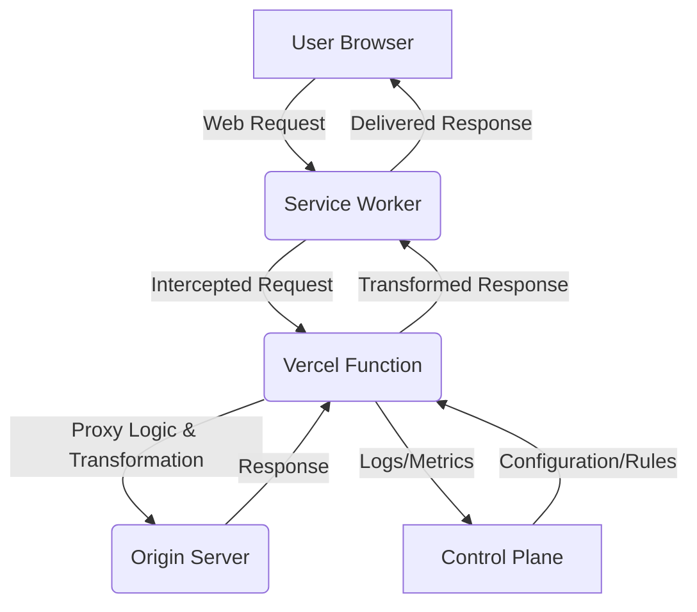
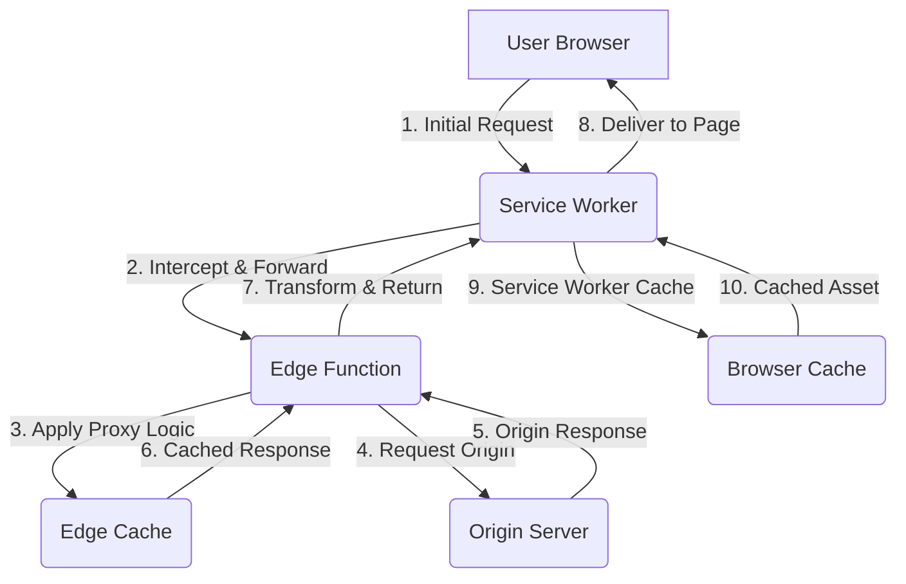

# Software Specifications: Service-Worker Based Web Proxy with Scramjet and Vercel Functions

**Author**: Manus AI
**Date**: October 01, 2025
**Version**: 2.0

## 1. Introduction

This document details the software specifications for a novel web proxy architecture that leverages **Service Workers**, **Scramjet**, and **Vercel Functions**. The primary objective is to develop a distributed, performant, and censorship-resistant web proxy solution that deviates from traditional centralized proxy server models. This approach aims to enhance user experience by reducing latency, improving scalability, and providing robust mechanisms for bypassing internet restrictions.

Traditional web proxies often rely on a single, centralized server or a cluster of persistent servers, which can introduce bottlenecks, single points of failure, and increased latency for geographically dispersed users. By integrating client-side Service Workers with globally distributed, ephemeral edge functions provided by Vercel, this architecture proposes a more resilient and efficient alternative.

## 2. Core Concepts

To understand the proposed architecture, it is essential to define the foundational technologies:

### 2.1. Service Workers

**Service Workers** are client-side programmable proxies that operate in the browser's background, separate from the main web page thread. They intercept network requests originating from the web application they control, enabling powerful capabilities such as offline support, sophisticated caching strategies, and programmatic modification of requests and responses [1]. In this proxy architecture, the Service Worker acts as the initial interception point, routing traffic and applying client-side logic.

### 2.2. Vercel Functions

**Vercel Functions** are serverless compute instances deployed on Vercel's global edge network, geographically close to end-users. These functions are ephemeral, meaning they are provisioned on-demand to handle specific requests and de-provisioned shortly thereafter. This model offers significant advantages in terms of reduced latency, improved performance, and automatic scalability, as computation occurs closer to the user rather than at a distant central server [5]. Vercel Functions are ideal for tasks like request modification, content transformation, and dynamic routing, making them the chosen platform for the core proxy logic.

### 2.3. Scramjet

In the context of web proxies, **Scramjet** refers to an interception-based web proxy technology designed to evade internet censorship, bypass browser restrictions, and innovate web proxy mechanisms [3]. While Vercel Functions provide the execution environment, Scramjet's methodologies and algorithms for censorship evasion and content manipulation will be implemented within these functions. Scramjet provides the *logic*, while Vercel Functions provide the *infrastructure*.

## 3. Overall System Architecture

The proposed architecture is structured into three logical layers, working in concert to provide a seamless proxy experience:

1.  **Client-Side Interception Layer**: Managed by the Service Worker within the user's browser.
2.  **Edge Processing Layer**: Comprising temporary, serverless **Vercel Functions**.
3.  **Control Plane**: A backend service for centralized management, configuration, and monitoring.

### 3.1. Architectural Diagram

*Figure 1: High-Level System Architecture Diagram*

### 3.2. Request Flow Overview

The lifecycle of a web request through this proxy system is as follows:

1.  A user accesses a web application (the controlled page) where the Service Worker is registered and active. The Service Worker's scope defines which URLs it can intercept.
2.  The controlled page initiates a network request (e.g., `fetch`, `XMLHttpRequest`, image load, navigation).
3.  The **Service Worker** intercepts this request via its `fetch` event listener. This is the initial point of intervention where client-side logic can be applied.
4.  The Service Worker processes the intercepted request. Based on predefined rules or dynamic instructions received from the Control Plane, it constructs a new request destined for the **Edge Processing Layer**.
5.  The Service Worker sends the request to a designated endpoint of a **Vercel Function**.
6.  The **Vercel Function** receives the request. This function is a temporary, serverless compute instance deployed at a network edge location chosen for its proximity to the user, minimizing latency.
7.  The Vercel Function applies the core proxy logic, which may include advanced Scramjet-driven techniques such as:
    *   **URL Rewriting**: Modifying the target URL to bypass restrictions or route to alternative origins.
    *   **Header Manipulation**: Adding, removing, or modifying HTTP headers (e.g., `User-Agent`, `Referer`, `Origin`, `Cookie`) to obscure client identity or conform to origin server requirements.
    *   **Content Transformation**: On the response path, modifying HTML, CSS, JavaScript, or other content to evade censorship, inject scripts (e.g., for analytics or ad blocking), or optimize delivery (e.g., image compression).
    *   **Authentication/Authorization**: Implementing access control logic at the edge before forwarding the request to the origin.
    *   **Dynamic Routing**: Determining the optimal upstream origin server based on factors like load, geographic location, or content type.
8.  The Vercel Function forwards the (potentially modified) request to the actual **Origin Server**.
9.  The Origin Server processes the request and returns a response to the Vercel Function.
10. The Vercel Function processes this response, applying further transformations (e.g., content modification, header adjustments) as required by the proxy logic, before sending it back to the Service Worker.
11. The Service Worker receives the response from the Vercel Function. It may perform additional client-side post-processing, such as caching the response or making final content adjustments.
12. The Service Worker delivers the final response to the controlled web page, which renders it as if it had been fetched directly from the network.

## 4. Component Specifications

### 4.1. Service Worker (Client-Side Interception Layer)

**Purpose**: To serve as the client-side entry point for the proxy, intercepting all network requests and orchestrating communication with the Edge Processing Layer.

**Key Responsibilities**:
*   **Registration and Lifecycle Management**: Handle the installation, activation, and updates of the Service Worker script, ensuring it maintains control over its defined scope.
*   **Request Interception**: Listen for `fetch` events for all outgoing requests within its scope, acting as a programmable network proxy.
*   **Request Transformation**: Modify request URLs, headers, and potentially the request body before forwarding the request to the Edge Processing Layer. This can include sanitizing client-specific headers or adding proxy-specific identifiers.
*   **Communication with Edge Functions**: Initiate `fetch` requests to the configured Edge Function endpoint, passing the intercepted request details and any necessary context.
*   **Response Handling**: Receive responses from Edge Functions, perform optional client-side post-processing (e.g., further content adjustments, caching decisions), and deliver the final response to the main browser thread.
*   **Caching Strategy**: Implement intelligent caching mechanisms (e.g., `stale-while-revalidate`, `cache-first`, `network-first`) for static assets, frequently accessed content, or responses explicitly marked for caching by the Edge Processing Layer. This enhances performance and enables offline capabilities.
*   **Error Handling and Fallback**: Gracefully handle network errors, failures in communication with edge functions, or unresponsive edge functions, potentially falling back to direct network requests or cached responses.
*   **Bypass Mechanisms**: Provide a configurable mechanism to bypass the Service Worker for specific requests, URLs, or in debugging scenarios.

**Technical Considerations**:
*   **Scope Definition**: The Service Worker's scope must be carefully defined to control which parts of the application or origin it can intercept. This is crucial for security and proper functioning.
*   **Security Context**: Service Workers operate only over HTTPS (or localhost), ensuring secure communication channels. Cross-origin restrictions apply to `fetch` calls made *from* the Service Worker, but it can effectively proxy requests *for* its own origin.
*   **Performance Optimization**: Efficient handling of `fetch` events and asynchronous operations is critical to avoid introducing perceptible latency to user interactions.
*   **Client-Side Logic**: Minimize complex logic within the Service Worker to keep it lean and fast, offloading heavy processing to edge functions.

### 4.2. Edge Processing Layer (Vercel Functions)

**Purpose**: To execute the core, distributed proxy logic, providing scalable and ephemeral compute for advanced request and response manipulation using Vercel's edge network.

**Key Responsibilities**:
*   **Request Reception**: Receive intercepted requests forwarded by Service Workers from various client browsers.
*   **Core Proxy Logic**: Implement the primary functions of the proxy, leveraging Scramjet's algorithms within the Vercel Function environment for:
    *   **Censorship Evasion**: Advanced URL and content rewriting, domain fronting, protocol obfuscation, or other techniques to bypass internet filters and restrictions.
    *   **Content Modification**: Dynamically injecting/removing scripts, modifying DOM structures, altering media links, re-encoding content, or applying ad-blocking rules.
    *   **Header Management**: Stripping sensitive client-side headers, adding necessary headers for upstream communication with origin servers, or normalizing headers.
    *   **Session Management**: While Vercel Functions are ideally stateless, they may interact with external state management systems (e.g., Vercel KV, Upstash Redis) for user sessions or other persistent data.
    *   **Dynamic Routing**: Determining the ultimate origin server based on various factors such as geographic location, server load, content type, or user-specific rules.
*   **Origin Communication**: Forward modified requests to the appropriate origin servers and receive their responses.
*   **Response Transformation**: Process responses received from origin servers, applying further content modifications, header adjustments, or data compression before sending them back to the Service Worker.
*   **Scalability**: Automatically scale horizontally to handle varying loads from a multitude of client Service Workers across different geographic regions, leveraging Vercel's serverless infrastructure.
*   **Geographic Distribution**: Deploy across Vercel's global edge network to ensure minimal latency for users worldwide.

**Technical Considerations**:
*   **Platform**: The Edge Processing Layer will be implemented using **Vercel Functions**.
*   **Runtime**: The Vercel Edge Runtime is preferred for its performance and low latency. However, for tasks requiring Node.js APIs, the standard Vercel Serverless Functions runtime can be used.
*   **Stateless Design**: Vercel Functions should primarily be stateless to maximize scalability and resilience. Any required state should be managed externally (e.g., in Vercel KV, a distributed key-value store accessible from the edge).
*   **Cold Start Mitigation**: Vercel's platform is optimized for low cold start times. However, the impact of cold starts should be monitored, and for critical paths, strategies like keeping functions warm might be considered if available.
*   **Security**: Implement robust security measures, including secure communication channels (HTTPS), rigorous input validation and sanitization, and access controls to prevent unauthorized access or malicious activity. Vercel's environment variables should be used for storing sensitive information like API keys.
*   **Configuration Management**: Vercel Edge Config can be used for dynamic configuration of proxy rules and other parameters, allowing for real-time updates without redeploying the functions.

### 4.3. Control Plane

**Purpose**: To provide centralized management, configuration, monitoring, and analytics for the distributed Service Worker and Edge Function proxy system.

**Key Responsibilities**:
*   **Configuration Management**: Store, manage, and distribute proxy rules, censorship evasion techniques, content transformation logic, and other operational parameters to the Edge Processing Layer and potentially to Service Workers.
*   **Logging and Monitoring**: Aggregate logs and metrics from all deployed edge functions. This includes request/response details, performance data, error rates, and security events, crucial for operational visibility and debugging.
*   **Dynamic Routing API**: Provide an API that edge functions can query in real-time for dynamic routing decisions, optimal origin server selection, or A/B testing configurations.
*   **User Management and Policy Enforcement**: If the proxy is a service, manage user accounts, subscriptions, access policies, and usage quotas.
*   **Deployment and Update Management**: Facilitate the deployment and updates of edge functions across various edge platforms, ensuring consistency and version control.
*   **Analytics and Reporting**: Process aggregated data to provide insights into proxy usage, performance, and effectiveness of censorship evasion techniques.

**Technical Considerations**:
*   **API Design**: A well-defined, secure, and performant API for communication between the Control Plane and the Edge Processing Layer is essential.
*   **Scalability and Reliability**: The Control Plane itself must be designed for high availability and scalability to support the distributed nature of the proxy.
*   **Security**: Implement strong authentication, authorization, and encryption to protect sensitive configurations, user data, and operational insights.
*   **Data Storage**: Utilize a robust and scalable database solution for storing configurations, logs, and user data.

## 5. Data Flow and Caching Strategies

### 5.1. Data Flow Diagram

*Figure 2: Detailed Data Flow with Caching Layers*

### 5.2. Caching Strategy

A multi-layered caching strategy is integral to optimizing performance, reducing latency, and minimizing load on origin servers:

1.  **Service Worker Cache (Client-Side)**: The Service Worker maintains a local cache within the user's browser. This cache is highly effective for static assets (CSS, JavaScript, images, fonts) and potentially for API responses that are not highly dynamic. Recommended strategies include:
    *   `Cache-First, then Network`: Serve from cache immediately, then update cache from network in background.
    *   `Stale-While-Revalidate`: Serve cached content instantly while asynchronously fetching a fresh version from the network to update the cache for future requests.
    *   `Network-First, then Cache`: Attempt to fetch from the network; if unsuccessful, fall back to the cache.
2.  **Edge Cache (Distributed)**: The Edge Processing Layer should leverage the caching capabilities of the chosen edge platform. This cache is distributed globally and shared across multiple users in the same geographic region, providing a significant performance boost for popular content. The edge cache can store responses from origin servers, content transformations, and dynamically generated assets. It acts as a crucial intermediary, reducing traffic to origin servers.
3.  **Origin Cache (Server-Side)**: The origin server itself may implement HTTP caching headers (e.g., `Cache-Control`, `Expires`, `ETag`, `Last-Modified`). The Service Worker and Edge Cache layers must respect these headers to ensure data freshness and consistency, while still applying proxy-specific caching logic where appropriate.

## 6. Security Considerations

Security is paramount for a web proxy, especially one designed to bypass restrictions. Key considerations include:

*   **HTTPS Everywhere**: All communication channels—between the client browser and Service Worker, Service Worker and Edge Functions, and Edge Functions and Origin Servers—**must** be encrypted using HTTPS to prevent eavesdropping, tampering, and man-in-the-middle attacks.
*   **Cross-Origin Resource Sharing (CORS)**: Edge functions will be making requests to various origin servers on behalf of the client. Proper CORS configuration is essential to ensure that legitimate cross-origin requests are handled correctly while preventing unauthorized access.
*   **Input Validation and Sanitization**: All input received by edge functions (from Service Workers or directly) must be rigorously validated and sanitized to prevent common web vulnerabilities such as injection attacks (e.g., XSS, SQL Injection) and command injection.
*   **Data Privacy and Anonymity**: The proxy should be designed to minimize the collection, storage, and logging of personally identifiable information (PII) and user browsing data. Any necessary logging should be anonymized and retained only for essential operational purposes.
*   **Service Worker Security**: The Service Worker script itself must be protected from unauthorized modification. Techniques like Subresource Integrity (SRI) can be used to ensure the integrity of the Service Worker script. The Service Worker's scope should be carefully restricted to prevent it from controlling unintended origins.
*   **Abuse Prevention**: Implement mechanisms to detect and mitigate abuse, such as rate limiting on edge functions, IP blacklisting, or CAPTCHA challenges for suspicious traffic patterns.

## 7. Performance and Scalability

This architecture is inherently designed for high performance and scalability:

*   **Reduced Latency**: The combination of client-side Service Worker caching and geographically distributed edge functions ensures that content is served from the closest possible location, significantly reducing network latency.
*   **Automatic Scalability**: The serverless nature of edge functions provides automatic horizontal scaling. The platform dynamically provisions and de-provisions compute resources based on demand, ensuring the proxy can handle fluctuating traffic loads without manual intervention.
*   **Cold Start Mitigation**: While cold starts are a characteristic of serverless functions, platform-specific optimizations (e.g., provisioned concurrency, faster runtimes) and strategic warming techniques can minimize their impact on user experience.
*   **Resource Optimization**: Edge functions are designed for efficient execution, often with lower resource consumption compared to traditional server environments, contributing to overall system efficiency.

## 8. Future Enhancements

Potential future enhancements for this service-worker based web proxy include:

*   **Dynamic Configuration Management**: Develop a robust system for real-time updates of proxy rules, censorship evasion techniques, and content transformation logic without requiring redeployment of Service Workers or edge functions.
*   **Advanced Censorship Evasion Techniques**: Integrate more sophisticated methods such as domain fronting, protocol obfuscation, and peer-to-peer routing to enhance resilience against advanced censorship mechanisms.
*   **User-Configurable Settings**: Implement a user interface allowing end-users to customize their proxy experience, including enabling/disabling specific features, selecting preferred edge locations, or defining custom routing rules.
*   **Comprehensive Analytics and Reporting**: Provide detailed dashboards and reports for administrators and potentially users, offering insights into traffic patterns, performance metrics, and the effectiveness of censorship evasion.
*   **WebAssembly Integration**: Explore the use of WebAssembly (Wasm) within Service Workers and edge functions for performance-critical proxy logic, offering near-native execution speeds.

## 9. Conclusion

This document outlines a comprehensive software specification for a service-worker based web proxy that leverages Scramjet and Vercel Functions. By combining client-side interception with distributed, ephemeral compute at the network edge provided by Vercel, this architecture offers a highly performant, scalable, and resilient solution for web proxying, particularly effective in environments requiring censorship circumvention. The modular design allows for flexible implementation and future expansion, positioning it as a robust alternative to traditional proxy infrastructures.

## 10. References

[1] Mozilla. (n.d.). *Service Worker API - Web - MDN*. Retrieved from [https://developer.mozilla.org/en-US/docs/Web/API/Service_Worker_API](https://developer.mozilla.org/en-US/docs/Web/API/Service_Worker_API)
[2] Netlify. (2022, May 19). *Edge Functions Explained*. Retrieved from [https://www.netlify.com/blog/edge-functions-explained/](https://www.netlify.com/blog/edge-functions-explained/)
[3] Titanium Network. (n.d.). *Scramjet*. Retrieved from [https://docs.titaniumnetwork.org/proxies/scramjet/](https://docs.titaniumnetwork.org/proxies/scramjet/)
[4] Vercel. (n.d.). *Vercel Functions*. Retrieved from [https://vercel.com/docs/functions](https://vercel.com/docs/functions)

